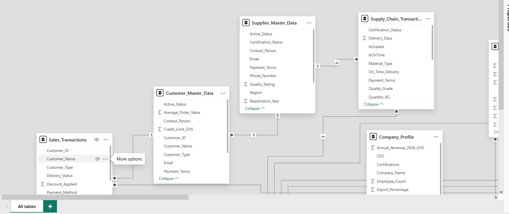

# POWER BI DASHBOARD
## INTRODUCTION
This project presents a comprehensive business analytics strategy analysis for a cocoa processing and chocolate manufacturing company. The analysis is conducted using Power BI to transform raw business data into interactive dashboards that support strategic decision-making.
## PROBLEM STATEMENT
The coca processing Ltd operates in a highly competitive and rapidly changing business environment influenced by economic fluctuations, technological advancements, environmental sustainability concerns, supply chain disruptions, regulatory requirements and changing consumer preferences. The absence of integrate analytical system limits management's ability to identify key business trends, evaluate organizational performance, monitor external environmental factors and respond proactively to emerging risks and opportunities.
## Data Importation
The dataset was imported into Power BI from the source file and loaded into Power Query Editor for preprocessing and transformation.
Tools Used
Power BI Desktop
Power Query Editor
Data Cleaning
## Activities Performed
Removed duplicate records
Eliminated blank rows and unnecessary columns
Corrected spelling inconsistencies
Replaced null or missing values where necessary
Standardized text formatting using uppercase and proper case transformations
Purpose
## Data Type Transformation
Filtering and Sorting
Irrelevant records and outliers were filtered out to maintain data relevance.
## DAX (Data Analysis Expressions) was used to create custom calculations and KPIs.
Examples
Performance indicators
Benchmark comparisons
Percentage calculations
Status indicators (Above Benchmark / Below Benchmark)
Sample DAX Formula
Status = 
IF('SWOT Data'[Score] >= 'SWOT Data'[Benchmark],"Above Benchmark","Below Benchmark")
## Purpose
These calculations enabled dynamic analysis and interactive reporting.
## Data Modeling
Relationships were created between tables to establish a structured data model.
 

## Conditional Formatting Preparation
The cleaned and transformed dataset was then loaded into Power BI for dashboard development and reporting.
The transformation process significantly improved:
Data accuracy
Dashboard performance
Visualization quality
Reporting reliability
Decision-making efficiency
The final Power BI dashboard provides interactive, professional, and data-driven insights for strategic business analysis.
## Technologies Used
Power BI Desktop
